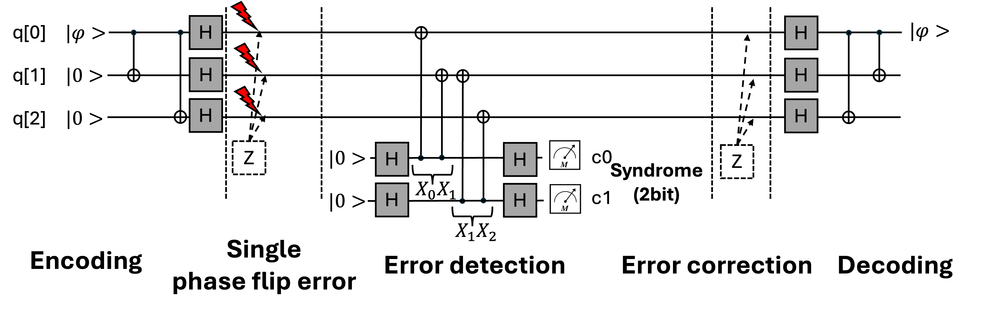

# Repetition Code (Three-qubit Error Correction Code)

# Objective
- Understand the Repetition Code, the simplest quantum error correction code, where a single qubit is encoded into multiple qubits by repeating it multiple times.
- Perform a **Monte Carlo** analysis to classify outcomes into three categories: No Error (NE), Correctable Error (CE), and Uncorrectable Error (UE).
- Understand the difference between correcting bit-flip (X) vs. phase-flip (Z) errors.

# Prerequisite
- Read the foundational paper for the three-qubit bit-flip code **[1]**.

# Overview
1) Repetition Code (X Error)

2) Repetition Code (Z Error)

# To do
- Complete the code in the sections marked **Fill the code**.

# Getting Started
- $ python main.py

# Answer (Solution Folder)
- NE: ≈ 250
- CE: ≈ 750
- UE: 0

If the result differs from the above, please modify the code accordingly.

# Hint
- X Error: It can detect and correct single bit flip error.
- Z Error: If you want to correct single phase flip error, add a **Hadamard gate**.
- It encodes a single logical qubit into three physical qubits by repeating the qubit three times.

# Additioanl Information (History)
- A classical repetition code protects information from bit-flip errors by encoding a single bit into a redundant string of multiple bits.
- The classical repetition code cannot be directly translated to the quantum realm due to the **no-cloning theorem**, which prohibits creating an exact copy of an unknown quantum state.
- Peres' solution - The three-qubit bit-flip code **[1]**.
- To circumvent the no-cloning theorem, Peres proposed a method that uses entanglement to encode a single qubit into a redundant system of three qubits.

# References
- **[1]** Peres, Asher. "Reversible logic and quantum computers." Physical review A 32.6 (1985): 3266.
