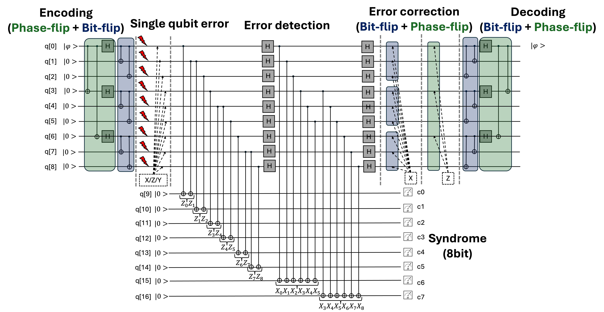

# 9-qubit [[9, 1, 3]] Shor Code

# Objective
- Understand the [[9, 1, 3]] Shor Code **[1]**, the first quantum error correction code, developed by Peter Shor. It encodes one logical qubit into nine physical qubits.
- Understand the **Calderbank-Shor-Steane (CSS) codes** (e.g., Steane code, toric code, and surface code), the stabilizer codes obtained by combining together certain pairs of classical linear codes (see [[[7, 1, 3]] Steane Code](https://github.com/dongwhee-kim/QEC_Exercise/tree/main/003_Steane_Code)).
- Perform a **Monte Carlo** analysis to classify outcomes into three categories: No Error (NE), Correctable Error (CE), and Uncorrectable Error (UE).
- Understand the Shor Code's challenges, including high redundancy, hard computation [X, Z are easy].

# Prerequisite
- Read the foundational paper for the Shor Code **[1]**.

# Overview
1) Shor Code (Single Qubit Error Correction)

2) (Hint) Encoding - Code Concatenation

# To do
- Complete the code in the sections marked **Fill the code**.

# Getting Started
- $ python main.py

# Answer (Solution Folder)
- NE ≈ 100
- CE ≈ 900
- UE: 0

If the result differs from the above, please modify the code accordingly.

# Hint
- It utilizes a code construction technique called **code concatenation**.
- It utilizes two-step error correction
 1) [Intra-Block] Bit-flip correction
 2) [Inter-Block] Phase-flip correction

# Additioanl Information (History)
- The development of quantum error correction faced a significant conceptual hurdle: the **no-cloning theorem**, which states that it is impossible to create an exact copy of an unknown quantum state.
- This theorem seemed to prevent the creation of redundant copies, a cornerstone of classical error correction.
- However, a breakthrough was achieved by realizing that information could be protected without copying.
- Instead of duplicating the data, the information of a single logical qubit can be distributed across a highly entangled state of several physical qubits.
- Peter Shor was the first to formalize this, discovering a method to store the information of one logical qubit onto a highly entangled nine-qubit state.
- This "Shor code" is capable of **correcting any arbitrary single-qubit error**, whether it is a bit-flip error, a phase-flip error, or a combination of both.
- The bit-flip and phase-flip don't have to be on the same qubit - they can both occur on different qubits, and the code can still fix it.

# References
- **[1]** Shor, Peter W. "Scheme for reducing decoherence in quantum computer memory." Physical review A 52.4 (1995): R2493.
