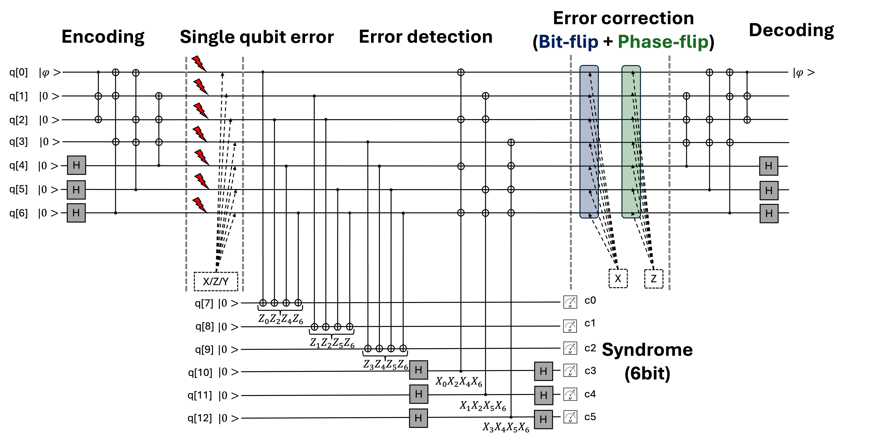

# 7-qubit [[7, 1, 3]] Steane Code

# Objective
- Understand the [[7, 1, 3]] Steane Code **[1]**, a seven-qubit code that can correct both bit flip and phase flip errors with **fewer redundancy** than [[[9, 1, 3]] Shor Code](https://github.com/dongwhee-kim/QEC_Exercise/tree/main/002_Shor_Code).
- Understand the code construction of Steane Code based on [[7, 4, 3] Hamming Code](https://github.com/dongwhee-kim/ECC-exercise/tree/main/01_Basic/01_7_4_Hamming_code).

# Prerequisite
- Read the foundational paper for the Steane Code **[1]**.

# Overview
1) Steane Code (Single Qubit Error Correction)

2) (Hint) Code Construction of Steane Code based on Hamming Code

# To do
- Complete the code in the sections marked **Fill the code**.

# Getting Started
- $ python main.py

# Answer (Solution Folder)
- NE ≈ 143
- CE ≈ 857
- UE: 0

If the result differs from the above, please modify the code accordingly.

# Hint
- Steane Code uses the classical binary [7, 4, 3] Hamming Code to correct for both bit-flip (X) errors and phase-flip (Z) errors.
- The bit-flip and phase-flip don't have to be on the same qubit - they can both occur on different qubits, and the code can still fix it.

# Additional Information
- Steane Code is also a quantum Color Code.

# References
- **[1]** Steane, Andrew M. "Error correcting codes in quantum theory." Physical Review Letters 77.5 (1996): 793.
