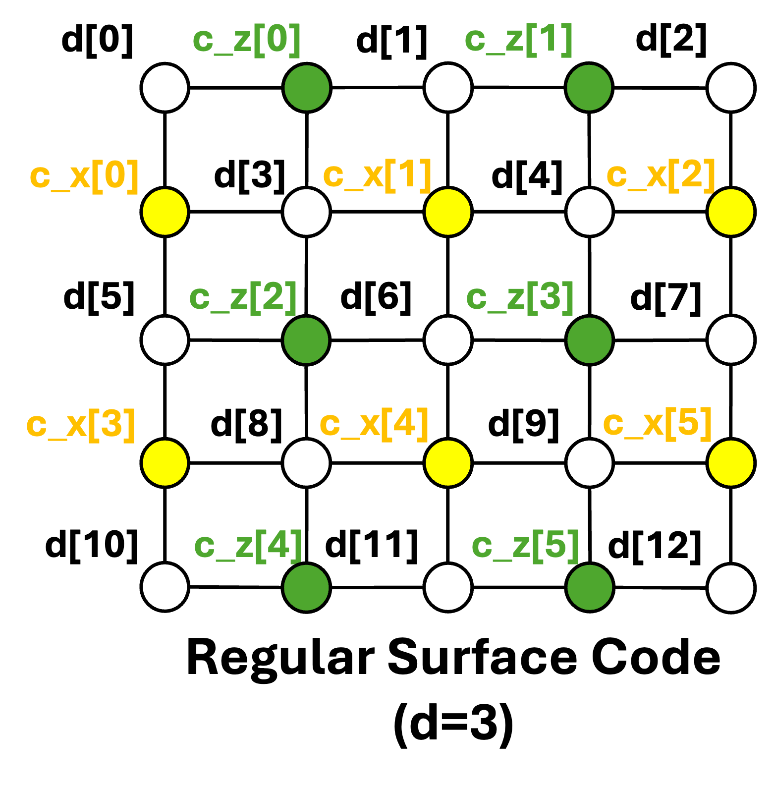

# Regular Surface Code

# Objective
- Understand the Regular Surface Code **[1]**, a topological error correction code that uses a two-dimensional lattice of qubits to encode logical qubits.
- Understand the **Minimum Weight Perfect Matching (MWPM)** **[2]** decoding method (approach to graph pairing)
- It has a high error correction threshold and is considered one of the most promising techniques for large-scale, fault-tolerant quantum computing.
- The surface code is used by the [Azure Quantum Resource Estimator](https://learn.microsoft.com/en-us/azure/quantum/overview-resources-estimator#quantum-error-correction-schemes).

# Prerequisite
- Read the foundational paper for the Regular Surface Code **[1]**.

# Terminology
- Error threshold: Maximum tolerable error rate for successful error correction
- Encoding rate: Ratio of logical qubits to physical qubits
- Decoding complexity: Computational resources required for decoding and error correction

# Regular Surface Code Parameters

# Overview
1) Regular Surface Code Layout (Data Qubit (White), X-ancilla Qubit (Yellow), Z-ancilla Qubit(Green))

# To do
- Complete the code in the sections marked **Fill the code**.

# Getting Started
- $ python main.py

# Answer (Solution Folder)

# Hint
- 

# Additioanl Information
- Structure of Surface Code: Family of quantum error correction codes defined on a 2D lattice of qubits with local interactions that encodes logical qubits using a larger number of physical qubits.
- Advantages of Surface Code
 1) **High Error Threshold**: It can tolerate physical qubit error rates up to approximately 1%. This high threshold is crucial, as it makes the code viable for implementation on today's noisy intermediate-scale quantum (NISQ) devices.
 2) **Local Stabilizer Measurements**: Error detection only requires nearest-neighbor interactions between qubits on the 2D lattice. This simplifies the hardware connectivity requirements.
 3) **Scalability**: The code's 2D grid structure allows itself to increase the size of the lattice, making it a clear path toward large-scale, fault-tolerant quantum computing (FTQC).
- The key difference is that the Steane code is a **block code**, where all 7 qubits are treated as a single, static block. The circuit you showed ($[[7, 1, 3]]$) nicely fits on one diagram.
- The surface code is a **topological code**. Its circuit is defined by its 2D grid layout and, most importantly, it's not a single "encode-detect-decode" circuit. Instead, it's a repeating cycle of measurements.
- IBM: Heavy hex lattice architecture
- Google: Surface Code

# References
- **[1]** Fowler, Austin G., et al. "Surface codes: Towards practical large-scale quantum computation." Physical Review A—Atomic, Molecular, and Optical Physics 86.3 (2012): 032324.
- **[2]** Edmonds, Jack. "Paths, trees, and flowers." Canadian Journal of mathematics 17 (1965): 449-467.