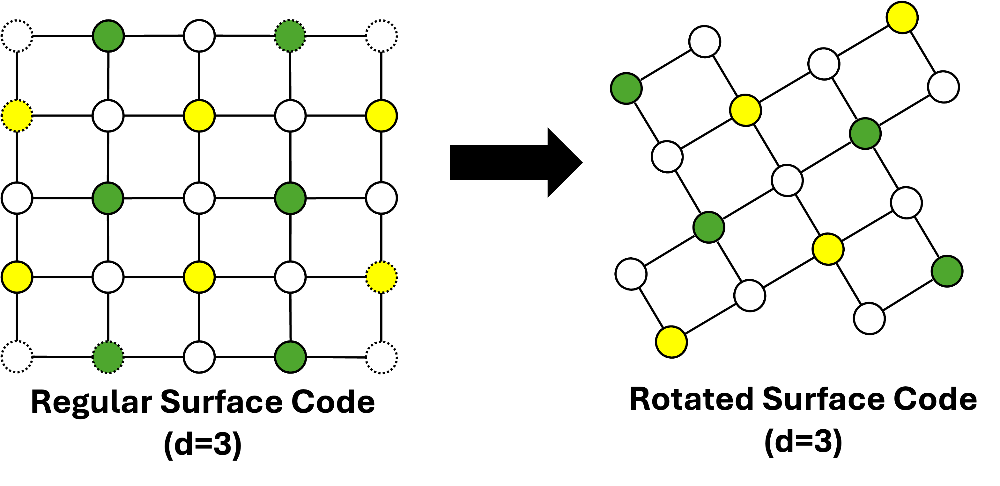
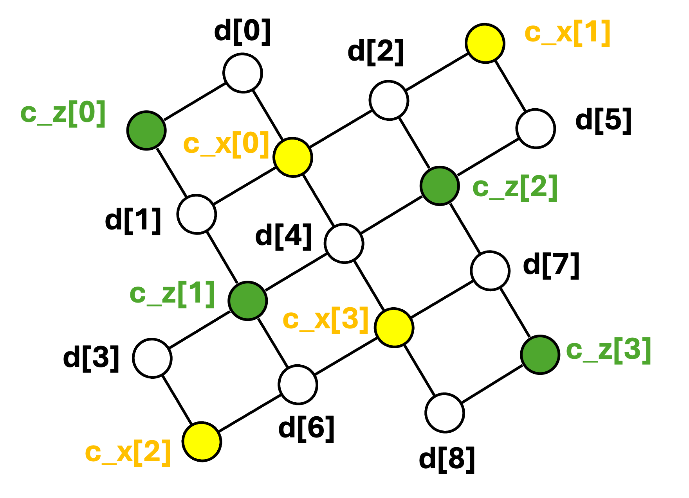

# Rotated Surface Code

# Objective
- Understand the Rotated Surface Code.

# Rotated Surface Code Parameters

# Overview
1) Regular to Rotated Surface Code Transformation

2) Rotated Surface Code Layout

# Additional Information
- 