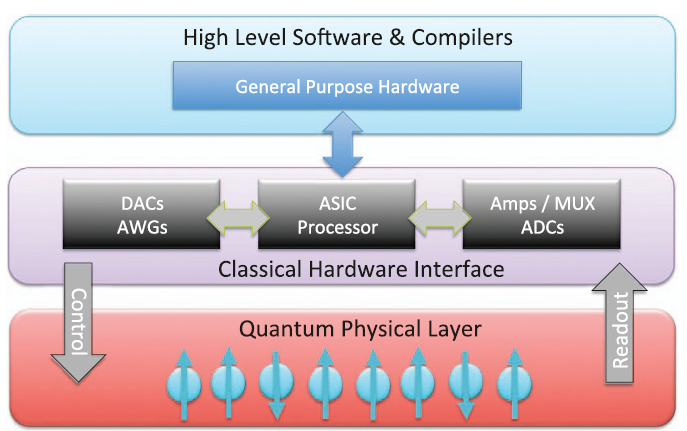
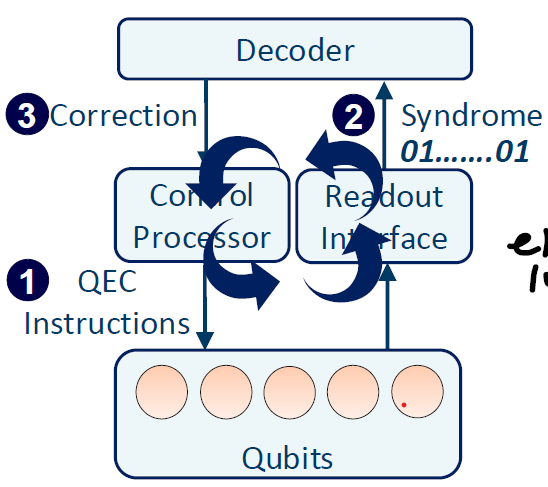
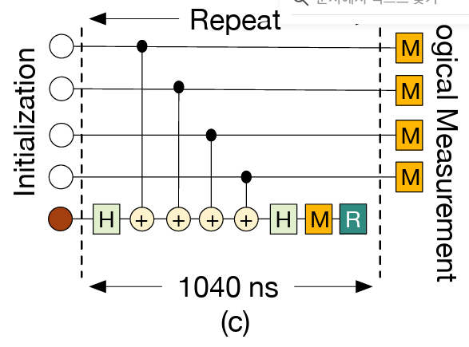

# Background: Real-Time Quantum Error Correction

This document outlines the fundamental architecture and timing constraints of real-time Quantum Error Correction (QEC).

**Specifically focusing on superconducting (IBM, Google) qubit systems.**

# 1. What is QEC? Why is it needed?

**Source: [IBM Quantum Roadmap 2025](https://www.ibm.com/quantum/blog/ibm-quantum-roadmap-2025)**

## Past -> Current (2025, Quantum Error Mitigation) -> Future (Quantum Error Correction)

## Figure -> Each Errors

Quantum information is fragile. Without intervention, environmental noise destroys quantum states (decoherence).

**Quantum Error Characterization**
- **Gate Error**: A deviation from the ideal quantum gate operation, causing incorrect quantum states due to noise or other imperfections. Error-rates typically in the range of **0.1-1%**.
- **Decoherence Error**: Occurs when a quantum system interacts with its environment, causing the loss of quantum information stored in superposition or entanglement. It is typically characterized by two time constants, **$T_1$ (Relaxation)** and **$T_2$ (Dephasing)** times.
- **Measurement Error**: The discrepancy between the actual quantum state and the classical outcome obtained after measurement. This includes errors from state projection failure or detector inefficiencies. State $$|1\rangle$$ more prone to errors than state $$|0\rangle$$. Error-rates typically in the range of **1-4%**.
- **Correlated Error**: Errors that affect multiple qubits simultaneously or where an error on one qubit is dependent on the state or operation of another. These errors violate the standard assumption that errors occur independently.

    1) **Spectator Error**: Errors induced on a qubit (the spectator) that is not currently being operated on, often caused by the interaction with neighboring qubits undergoing gate operations.

    2) **Crosstalk Error**: Unintended coupling between qubits or control lines, where a signal intended for one qubit affects another (e.g., driving Qubit A inadvertently rotates Qubit B).
- **Leakage Error (Not a Pauli Error)**: A type of error where the qubit transitions out of the computational subspace (states $|0\rangle$ and $|1\rangle$) into **higher energy levels (e.g., $|2\rangle$)**, rendering standard quantum error correction protocols ineffective without specific leakage reduction techniques (e.g., Leakage Reduction Circuit (LRC)).

To build useful quantum computers, we must distinctively handle errors in three ways:

**Quantum Error Suppression**
- Attempts to prevent errors before they happen.
- Quantum hardware is designed to be more resistant to noise.
- Focuses on hardware-level noise reduction.
- The most basic level of handling errors.

**Quantum Error Mitigation (used in NISQ era)**
- Attempts to reduce the effect of errors after they happen.
- Runs quantum circuits multiple times to estimate the error-free outcome.
- Focuses on post-processing.
- Useful for today's noisy quantum devices.
- E.g., Zero-noise extrapolation, Probabilistic error cancellation, Quasi-probability method, Virtual distillation method, Subspace expansion method.

- Attempts to detect and fix errors as they occur.
- Spreads a qubit's value across multiple physical qubits for redundancy.
- Focuses on real-time error detection and correction.
- More complex but necessary for fault-tolerant quantum computing.

# 2. QEC Overview & Timing Constraints

**Source: [Engineering the quantum-classical interface of solid-state qubits, npj Quantum Information, 2015](https://www.nature.com/articles/npjqi201511)**

## Figure -> QEC Instruction (FPGA -> Qubits) -> Syndrome (Qubit -> (Analog Signal) [inside Readout Interface Hardware Box] FPGA (Using ADC, Digital Bits, Syndromes) -> Decoder) -> Decoding -> Correction information (Decoder -> FPGA)
## Figure -> 1us constraints (ZZ stabilizers, XX stabilizers)

In superconducting systems, the QEC loop is a strict race against time. The system must detect and handle errors before the next batch of errors arrives.

**The 1µs Hardware Constraint**
- The syndrome extraction circuit on processors like Google Sycamore takes approximately **1µs** **[1, 2]**. If decoding takes longer than this, errors accumulate (backlog), causing the system to fail.

**The QEC Cycle (1µs Timeline)**
A single QEC Round consists of the following mandatory steps within the 1000ns budget:
- **Readout & State Discrimination (300ns - 500ns)**: The FPGA converts analog microwave signals from the QPU into digital bits (0 or 1). Process: Qubit $\rightarrow$ Resonator $\rightarrow$ Quantum Amplifier (TWPA/JPA) $\rightarrow$ ADC $\rightarrow$ **FPGA Logic (Demodulation & Discrimination)** $\rightarrow$ Digital State (0 or 1).
- **Transmission (tens of ns)**: Sending syndrome data from FPGA to the Decoder.
- **Decoding (200ns - 400ns)**: The Decoder calculates the error location using algorithms like **MWPM (Minimum Weight Perfect Matching)** or **Union-Find**.
- **Feedback Transmission**: The Decoder transmits a logical correction to the FPGA to reverse errors detected on the data qubits. The correction data is transmitted as a 2-bit signal per qubit. 00 (No Error) / 01 (Pauli-X Error) / 10 (Pauli-Z Error) / 11 (Pauli-Y Error).
- **Frame Update**: The FPGA updates the Pauli Frame record (e.g., Pauli Tracking **[3-5]**).

# 3. Decoding Architecture (Pauli Tracking [3-5])
## Figure -> A flow diagram: [Decoder Output] -> [FPGA Register (Pauli Frame)] -> [Next Gate Instruction Modified]. Show that the physical Qubit remains untouched. 

Modern QEC systems do **not** physically apply gates (X, Y, Z) to correct errors during the cycle because it introduces extra latency and noise. Instead, they use **Virtual Correction**.

**Pauli Tracking (Pauli Frame)**
- **Concept**: The FPGA maintains a "software ledger" (Pauli Frame) that tracks the current error state of every data qubit.
- **Mechanism**:

    1) The Decoder identifies an error (e.g., "Qubit 5 has a Z-flip").

    2) This info is sent to the FPGA.

    3) **Future Operations Update**: If the program needs to apply a gate to Qubit 5, the FPGA modifies the instruction on-the-fly (e.g., changing rotation direction) to account for the tracked error

# 4. Logical Errors & LER Calculation
## Figure -> A d=5 grid showing two scenarios: (A) A short, broken chain (Correctable, No Logical Error). (B) A complete chain connecting Top and Bottom (Logical Error/Failure).

Ideally, physical errors are identified and corrected by the decoder. A **Logical Error** occurs when the correction mechanism fails, resulting in corrupted logical information.

**Physical vs. Logical Error**
- **Physical Error**: A microscopic error (e.g., bit-flip or phase-flip) on a single physical qubit. This is a frequent occurrence due to environmental noise.
- **Logical Error**: A chain of physical errors connects one boundary of the surface code to the opposite boundary (e.g., Top-to-Bottom). This flips the encoded logical information ($|0\rangle_L \to |1\rangle_L$) despite the parity checks being satisfied..

### Calculating Logical Error Rate (LER)

To quantify performance, we calculate the Logical Error Rate (LER) by comparing the actual logical outcome against the expected outcome after error correction.

**1. General Mechanism** To verify if a logical error occurred after $N$ rounds:

1. **Measure Data Qubits**: Perform a transversal measurement of all data qubits at the end of the circuit.
2. **Calculate Parity**: Compute the raw parity ($M_{raw}$) of the logical operator chain (e.g., the product of Z operators along a column).
3. **Apply Correction**: Adjust the raw parity using the accumulated correction history ($C_{accumulated}$) derived from syndrome measurements. **$$M_{final} = M_{raw} \oplus C_{accumulated}$$**
   If $M_{final}$ differs from the initialized logical state, a logical error has occurred.

**2. Measurement in Stim [6] (Google's Framework)** In **Stim**, logical errors are measured by defining a logical frame using the `OBSERVABLE_INCLUDE` instruction. The LER calculation follows a **Monte Carlo** sampling process:

1. **Define Logical Observable**: You explicitly tell Stim which physical qubits constitute the logical operator (e.g., `OBSERVABLE_INCLUDE(0) Z 0 Z 5 ...`) at the start and end of the circuit.
2. **Sample & Decode**:
    1. Stim samples **shots** (detection events) from the noisy circuit.
    2. A decoder (e.g., PyMatching, Fusion Blossom) processes these detection events to predict whether the logical observable has flipped ($P_{predicted} \in \{0, 1\}$).
    3. Stim simultaneously tracks the ground truth of the actual logical frame flip caused by noise ($P_{actual}$).
3. **Verification**: A logical error is counted whenever the decoder's prediction fails to match the actual error realization: **$$Error_{logical} \iff P_{predicted} \neq P_{actual}$$**
4. **Final LER: $$LER = \frac{\text{Total Logical Errors}}{\text{Total Shots}}$$**  

# 5. Advanced Scalability (Brief)
## Figure -> Two separate Surface Code patches merging into one larger patch to perform a logical CNOT operation.

To run useful algorithms, we need more than just memory; we need logic operations between logical qubits.

**Lattice Surgery**: A technique to perform multi-qubit gates (like CNOT) between two separate logical surface code patches by temporarily merging their boundaries.

**Magic State Distillation**: Surface codes are not universal on their own. We need "Magic States" (high-fidelity T-states) distilled from noisy states to execute complex algorithms (non-Clifford gates).

# References
**[1]** Google Quantum AI. 2021. Exponential suppression of bit or phase errors with cyclic error correction. Nature 595, 7867 (2021), 383. https://doi.org/10.1038/ s41586-021-03588-y
**[2]** Google Quantum AI. Accessed: June 19, 2021. Quantum Computer Datasheet. https://quantumai.google/hardware/datasheet/weber.pdf.
**[3]** Paler, Alexandru, et al. "Software-based pauli tracking in fault-tolerant quantum circuits." 2014 Design, Automation & Test in Europe Conference & Exhibition (DATE). IEEE, 2014.
**[4]** Chamberland, Christopher, Pavithran Iyer, and David Poulin. "Fault-tolerant quantum computing in the Pauli or Clifford frame with slow error diagnostics." Quantum 2 (2018): 43.
**[5]** Knill, Emanuel. "Quantum computing with realistically noisy devices." Nature 434.7029 (2005): 39-44.
**[6]** Gidney, Craig. "Stim: a fast stabilizer circuit simulator." Quantum 5 (2021): 497.

**[1]** Das, Poulami, Aditya Locharla, and Cody Jones. "Lilliput: a lightweight low-latency lookup-table decoder for near-term quantum error correction." Proceedings of the 27th ACM International Conference on Architectural Support for Programming Languages and Operating Systems. 2022.

**[2]** Vittal, Suhas, Poulami Das, and Moinuddin Qureshi. "Astrea: Accurate quantum error-decoding via practical minimum-weight perfect-matching." Proceedings of the 50th Annual International Symposium on Computer Architecture. 2023.

**[3]** Ryan-Anderson, Ciaran, et al. "Realization of real-time fault-tolerant quantum error correction." Physical Review X 11.4 (2021): 041058.

**[4]** "Suppressing quantum errors by scaling a surface code logical qubit." Nature 614, no. 7949 (2023): 676-681.

