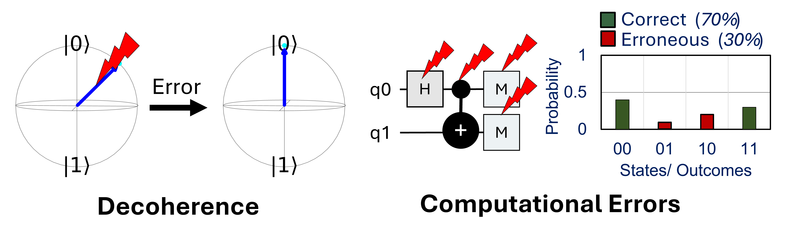
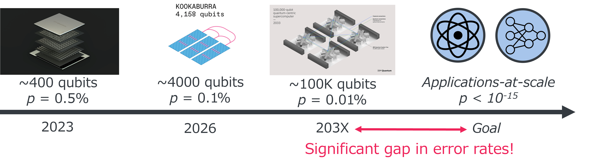
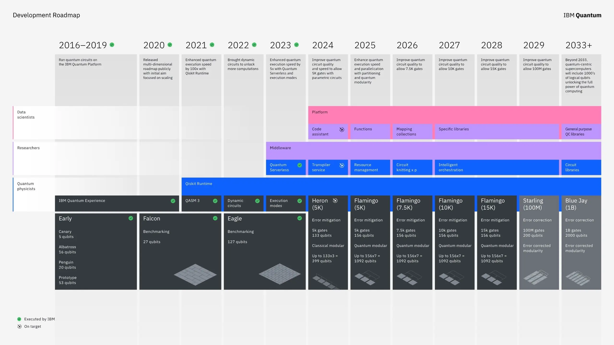
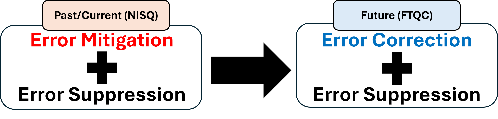
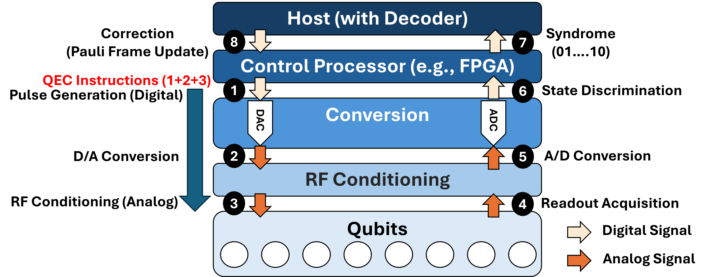
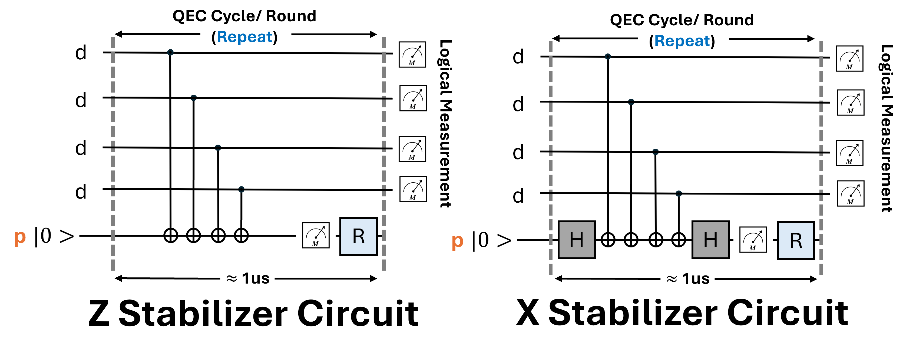
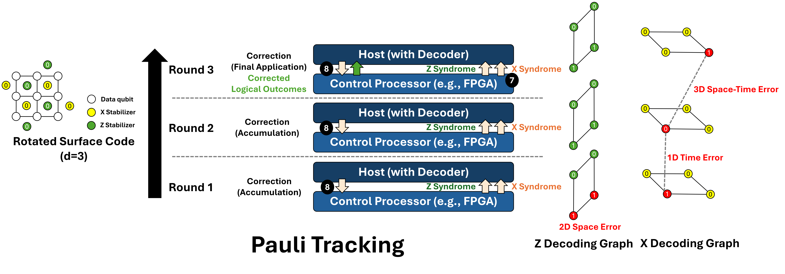
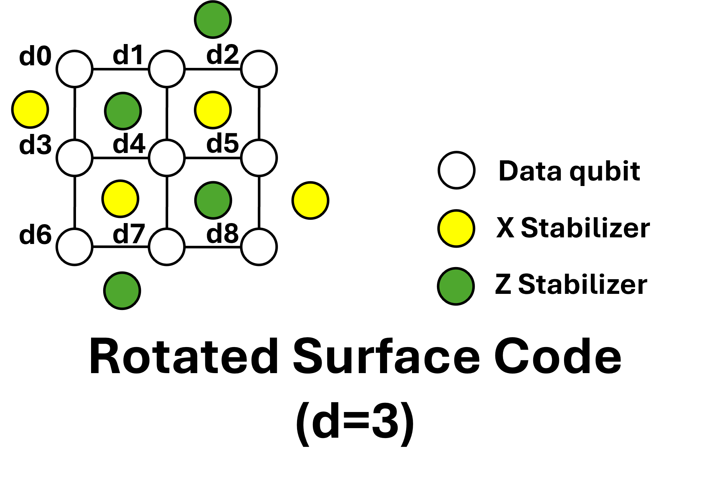
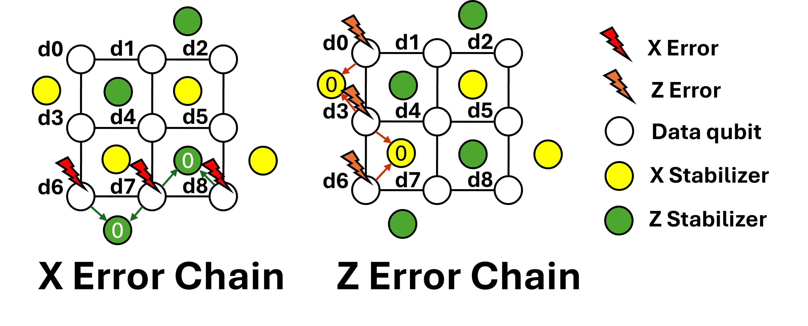
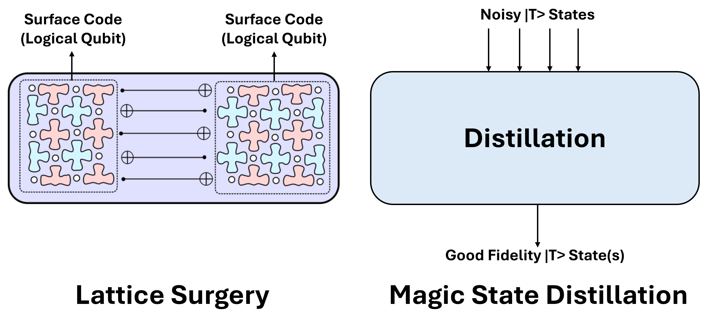

# Background: Real-Time Quantum Error Correction

This document outlines the fundamental architecture and timing constraints of real-time Quantum Error Correction (QEC).

**Specifically focusing on superconducting (IBM, Google) qubit systems.**

# 1. What is QEC? Why is it needed?

**Source: UT Austin - QUANTUM COMP SYS SW/ARCH PERSP (ECE 382V, Prof. Poulami Das)**

**Key Challenges in Quantum Computing** - Quantum states are inherently **fragile**, suffering from information loss due to environmental **decoherence** and **computational errors** stemming from sources such as imperfect gate operations and measurements.

**Quantum Error Characterization**
- **Gate Error**: A deviation from the ideal quantum gate operation, causing incorrect quantum states due to noise or other imperfections. Error-rates typically in the range of **0.1-1%**.
- **Decoherence Error**: Occurs when a quantum system interacts with its environment, causing the loss of quantum information stored in superposition or entanglement. It is typically characterized by two time constants, **$T_1$ (Relaxation)** and **$T_2$ (Dephasing)** times.
- **Measurement Error**: The discrepancy between the actual quantum state and the classical outcome obtained after measurement. This includes errors from state projection failure or detector inefficiencies. State $$|1\rangle$$ more prone to errors than state $$|0\rangle$$. Error-rates typically in the range of **1-4%**.
- **Correlated Error**: Errors that affect multiple qubits simultaneously or where an error on one qubit is dependent on the state or operation of another. These errors violate the standard assumption that errors occur independently.

    1) **Spectator Error**: Errors induced on a qubit (the spectator) that is not currently being operated on, often caused by the interaction with neighboring qubits undergoing gate operations.

    2) **Crosstalk Error**: Unintended coupling between qubits or control lines, where a signal intended for one qubit affects another (e.g., driving Qubit A inadvertently rotates Qubit B).
- **Leakage Error (Not a Pauli Error)**: A type of error where the qubit transitions out of the computational subspace (states $|0\rangle$ and $|1\rangle$) into **higher energy levels (e.g., $|2\rangle$)**, rendering standard quantum error correction protocols ineffective without specific leakage reduction techniques (e.g., Leakage Reduction Circuit (LRC)).

**Source: UT Austin - QUANTUM COMP SYS SW/ARCH PERSP (ECE 382V, Prof. Poulami Das)**

**Bridging the Error Gap**
- Current physical qubits suffer from relatively high error rates (typically **$\sim 10^{-3}$**).
- However, practical applications (e.g., large-scale factorization or chemical simulations) demand extremely high reliability, often requiring error rates as low as **$10^{-15}$**.
- To bridge this massive gap and build a useful Fault-Tolerant Quantum Computer (FTQC), we must efficiently handle errors in three fundamental ways - Quantum Error Suppression, Quantum Error Mitigation, and Quantum Error Correction.

**Source: [IBM Quantum Roadmap 2025](https://www.ibm.com/quantum/blog/ibm-quantum-roadmap-2025)**

**Quantum Error Suppression**
- Attempts to prevent errors before they happen.
- Quantum hardware is designed to be more resistant to noise.
- Focuses on hardware-level noise reduction.
- The most basic level of handling errors.
- E.g., Dynamic Decoupling

**Quantum Error Mitigation (used in NISQ era)**
- Attempts to reduce the effect of errors after they happen.
- Runs quantum circuits multiple times to estimate the error-free outcome.
- Focuses on post-processing.
- Useful for today's noisy quantum devices.
- E.g., Gate Cancellations, Instruction Reordering, Efficient-mapping to reduce SWAPs, Circuit Cutting / Circuit Knitting, State Transformation (e.g., Apply X gates before measurement), Noise Matrix, Zero-noise extrapolation, Probabilistic error cancellation, Quasi-probability method, Virtual distillation method, Subspace expansion method.

[Quantum Error Correction (QEC, required for FTQC)](https://research.ibm.com/topics/quantum-error-correction)
- Attempts to detect and fix errors as they occur.
- Spreads a qubit's value across multiple physical qubits for redundancy.
- Focuses on real-time error detection and correction.
- More complex but necessary for fault-tolerant quantum computing.
- E.g., Shor Code, Surface Code, QLDPC Code

# 2. FTQC Overview & Time Constraints

## FTQCs 'periodically (Steps ❶  $\rightarrow$ ❽)' extract information about errors and corrects them in real-time

In superconducting systems, Quantum Error Correction (QEC) relies on parity qubits to periodically extract information from data qubits via Z- or X-type stabilizer circuits (Surface Code has **degree-4**, four data qubits mapped to one parity qubit). This process, known as **syndrome extraction**, projects continuous errors into discrete Pauli errors. These cycles repeat from initialization until the data qubits are measured (called logical measurement), with each iteration termed a QEC cycle (or round). And the measurement outcome of the parity qubits is called a **syndrome**.

However, maintaining this loop is a strict race against time. On the existing device technology (Google Sycamore), the syndrome extraction circuit completes in approximately **1 µs** **[1, 2]**. This imposes a hard time constraint: if the decoding software takes longer than this hardware cycle, errors accumulate in a 'backlog,' eventually causing system failure. Consequently, designing accurate, real-time decoders is a critical area of research.

### Summary: Cycle Definitions & Hardware Mapping
- **Stabilizer Circuit Execution (Steps ❶  $\rightarrow$ ❻)**: Physically executing gates and measurements.
- **QEC Cycle / Round (Physical Loop) (Steps ❶  $\rightarrow$ ❻)**: The hardware loop that repeats every cycle.
- **Total Latency Budget (Steps ❶  $\rightarrow$ ❽)**: The entire closed-loop latency must be **< 1 µs** to correct errors to prevent accumulated errors.

**Detailed Description: The 1 µs QEC Feedback Loop**

**I. Control Path (Downlink): Executing the circuit instructions. (Time: Part of the cycle schedule)**
- Step ❶. Pulse Generation (Digital): The Control Processor (FPGA) triggers the cycle by generating digital waveforms for stabilizer gates and readout pulses.
- Step ❷. D/A Conversion: DACs convert these digital streams into analog baseband signals with high precision.
- Step ❸. RF Conditioning (Analog): Signals are upconverted to microwave frequencies and sent to the Qubits.

**II. Readout Path (Uplink): Extracting error information. (Time Budget: ~300 ns – 500 ns [7])**
- Step ❹. Readout Acquisition: The microwave signals interact with the qubits and resonators. The reflected signals, carrying the state information, travel back up the amplification chain.
- Step ❺. A/D Conversion: ADCs digitize the incoming RF signals for processing.
- Step ❻. State Discrimination (Syndrome Extraction): The FPGA performs real-time demodulation and integration on the raw data. **Outcome**: It determines the qubit states (0 or 1) and generates the syndrome.

**III. Feedback Path (Logical Layer): Calculating and applying corrections. (Time Budget: ~200 ns – 400 ns)**
- Step ❼. Syndrome Transmission: The extracted syndrome bits (e.g., 01...10) are transmitted from the FPGA to the Host (with Decoder) via a low-latency interface (e.g., PCIe) within tens of ns.
- Step ❽. Correction (Pauli Frame Update): The Decoder calculates the error location (using **MWPM** or **Union-Find**) and sends correction instructions back to the FPGA. To minimize latency, the Control Processor typically updates the Pauli Frame (virtual software correction) for the next round instead of applying physical gates **[4, 5]**. **Correction Information - 2 bits per data qubit (00 [No Error], 01 [X Error], 10 [Z Error], 11 [Y Error])**

# 3. Decoding Architecture: Pauli Tracking [3-5] & Time Axis

To satisfy the strict **1 µs latency budget**, we avoid applying physical correction pulses (e.g., applying a physical $X$ gate) inside the loop. Instead, we utilize **Pauli Tracking** and accumulate error information over time.

**I.Virtual Correction (Zero Latency)**
- **Concept**: Instead of physically "fixing" the qubit state with a microwave pulse, the Control Processor (FPGA) updates a classical software reference frame.
- **Mechanism**: If the Decoder identifies an error (e.g., "X-error on Data Qubit $d1$"), the system merely records this in the **Pauli Frame**.
- **Benefit**: The QEC cycle proceeds immediately without the delay of pulse modulation.

**II. The Time Axis: Waiting for $d$ Rounds**

Single-shot measurements are unreliable due to physical measurement errors. Therefore, we do not make a final decision based on a single cycle.
- **Accumulation**: We repeat the QEC cycle for $d$ rounds (where $d$ is the code distance of Surface Code).
- **Spacetime Volume**: The Host/Decoder collects the syndrome history over these $d$ rounds, creating a 3D spacetime decoding graph ($2D$ space $+ 1D$ time). **$m = (d - 1)$ rounds are required to match the code's error correction capability [8].**
    - **Space Error**: Data qubit errors
    - **Time Error**: Measurement errors in syndrome extraction
    - **Space-Time Error**: Gate errors in syndrome extraction
- **Delayed Correction**: The Decoder solves the matching problem (MWPM) utilizing **(X/Z) decoding graph** across this entire window to identify the most probable error chain.
- **Application: Delayed Correction Strategy**
    - **Rounds $1 \dots (d-1)$ (Accumulation)**: The Decoder identifies errors and updates the Pauli Frame in software. **Crucially, no corrections are applied to the qubits, and no logical data is transmitted to the Host for validation.** The system simply tracks the "virtual" error state.
    - **Round $d$ (Final Application & Validation)**: Upon the final measurement of data qubits, the accumulated Pauli Frame correction is **applied** to the raw measurement results. Only then is the **corrected logical outcome sent to the Host** to verify if the initial state was preserved.

# 4. Logical Errors & LER Calculation ($d=3$ Rotated Surface Code)

This section defines a **Logical Error** as a failure to preserve the encoded information after correction and details the step-by-step simulation workflow to calculate the **Logical Error Rate (LER)**.

**I. Physical vs. Logical Error**

Before calculating the error rate, we must distinguish between an error on a device and an error on information.
- **Physical Error**: A microscopic error (e.g., bit-flip or phase-flip) occurring on a single physical qubit. This is a frequent occurrence due to environmental noise and imperfect gates.
- **Logical Error (The Failure Event)**: A chain of physical errors that spans across the lattice, connecting opposite boundaries.
    - **Logical X Error ($X_L$ Error)**: A chain of physical X-errors connecting the **Left $\leftrightarrow$ Right** boundaries. Effect: Flips the Z-basis logical state ($|0\rangle_L \leftrightarrow |1\rangle_L$).
    - **Logical Z Error ($Z_L$ Error)**: A chain of physical Z-errors connecting the **Top $\leftrightarrow$ Bottom** boundaries. Effect: Flips the X-basis logical state ($|+\rangle_L \leftrightarrow |-\rangle_L$).

**II. Simulation Setup: The $d=3$ Lattice**

To verify if the Quantum Error Correction was successful, we simulate a **Distance-3 ($d=3$)** Rotated Surface Code.
- **Data Qubits** ($d$): 9 qubits carrying the logical information ($d0 \dots d8$).
- **Z-Stabilizers** (Green Circles): Measure the Z-parity of neighboring data qubits. Detect $X$ errors.
- **X-Stabilizers** (Yellow Circles): Measure the X-parity of neighboring data qubits. Detect $Z$ errors.

In a Rotated Surface Code, the lattice boundaries define the logical operators. For our $d=3$ setup:
- **Logical Z Operator ($Z_L$)**: A chain of $Z$ operators connecting the **Top (Smooth) and Bottom (Smooth)** boundaries. 
    - Path: e.g., $Z(d0) \otimes Z(d3) \otimes Z(d6)$.
- **Logical X Operator ($X_L$)**: A chain of $X$ operators connecting the **Left (Rough) and Right (Rough)** boundaries.
    - Path: e.g., $X(d6) \otimes X(d7) \otimes X(d8)$

**III. Logical Error Rate (LER) Calculation Flow**

We determine the logical error probability by comparing the measured logical parity with the expected value.

**Step 1: Initialization (State Preparation)** 
- Prepare the logical qubit in $|0\rangle_L$ (**Expected Value**).
- Physically, all 9 Data Qubits ($d0 \dots d8$) are initialized to $|0\rangle$.

**Step 2: The QEC Loop (Error Logging)**
- Execute the QEC cycle for $d$ rounds.
- The Decoder identifies errors and updates the **X-Error Log (Pauli Frame)**.
    - Why X-Log? Since we initialized in $|0\rangle$ (Z-basis), we are protecting against bit-flips (X-errors). We must track X-errors that could form a **Left-Right chain**.

**Step 3: Logical Measurement Computation** To check if the state is still $|0\rangle_L$, we measure the Logical Z Operator ($Z_L$).
- Select Logical Chain: The $Z_L$ operator corresponds to the column $d0 - d3 - d6$ (connecting Top-Bottom).
- Bitwise XOR (Apply Correction):
    - Perform a bitwise XOR between the Raw Measurement outcome and the Error Log.
    
    - $m'_{i} = m_{i} \oplus \text{log}_{i}$

- Reduction XOR (Parity Check):
    - Compute the final logical measurement bit ($M_{logical}$) by XORing the corrected bits along the chain.

    - $M_{logical} = m'_{0} \oplus m'_{3} \oplus m'_{6}$

**Step 4: Verdict & LER**
- **Verdict**:
    - If $M_{logical} == 0$: **Success** (State is $|0\rangle_L$).
    - If $M_{logical} == 1$: **Logical Error (Fail)**.
    - Interpretation: A **Left-Right chain of X-errors** must have crossed our vertical measurement line an odd number of times, flipping the logical parity to $|1\rangle_L$.
- **Calculation**: $P_{logical} \approx \frac{\text{Total Failures}}{\text{Total Experiments}}$

### Q: Why the syndrome remains 0 (undetected) for these error chains, connecting opposite boundaries?

A "Logical Error" occurs when a chain of physical errors spans the lattice. These chains are dangerous because they commute with the stabilizers, effectively "tricking" the detection system.

**1. Logical X Error Chain ($X_L$ Error)**
- **Scenario**: A continuous chain of physical X-errors **connects the Left and Right boundaries**.
- **Example Path**: $X(d6) \to X(d7) \to X(d8)$
- **Why Syndrome is 0 (Undetected)**: 
    - Z-Stabilizers (Green) are responsible for detecting X-errors by checking the parity of their neighbors.
    - However, in this chain, every internal Z-stabilizer touches two erroneous qubits (e.g., one stabilizer touches both $d6$ and $d7$, another touches $d7$ and $d8$).
    - Since stabilizers calculate parity ($1 \oplus 1 = 0$), two errors cancel each other out locally.
    - Result: All Z-stabilizers report **Syndrome 0 (No Error, but actual Error)**.
- **Consequence**: The decoder assumes the state is clean, but the logical qubit has been bit-flipped ($|0\rangle_L \to |1\rangle_L$).

**2. Logical Z Error Chain ($Z_L$ Error)**
- **Scenario**: A continuous chain of physical Z-errors **connects the Top and Bottom boundaries**.
- **Example Path**: $Z(d0) \to Z(d3) \to Z(d6)$
- **Why Syndrome is 0 (Undetected)**:
    - X-Stabilizers (Yellow) are responsible for detecting Z-errors.
    - Similar to the case above, any internal X-stabilizer along this path interacts with two errors (entering and leaving the stabilizer's region).
    - The parity check sees an even number of errors ($1 \oplus 1 = 0$).
    - Result: All X-stabilizers report **Syndrome 0 (No Error, but actual Error)**.
- **Consequence**: The decoder detects nothing, but the logical qubit has been phase-flipped ($|+\rangle_L \to |-\rangle_L$).

# 5. Advanced Topics

**Source: [(PRR'2025) Resource overheads and attainable rates for trapped-ion lattice surgery](https://journals.aps.org/prresearch/abstract/10.1103/PhysRevResearch.7.023088)**

To execute useful algorithms, we must bridge the gap between quantum memory and logical computation. This necessitates the use of Lattice Surgery and Magic State Distillation to complete the universal set of logic gates required for fault-tolerant quantum computing.

**Lattice Surgery**: A technique to perform multi-qubit gates (like CNOT) between two separate logical surface code patches by temporarily merging their boundaries.

**Magic State Distillation**: Surface codes are not universal on their own. We need "Magic States" (high-fidelity T-states) distilled from noisy states to execute complex algorithms (non-Clifford gates).

# References
**[1]** Google Quantum AI. 2021. Exponential suppression of bit or phase errors with cyclic error correction. Nature 595, 7867 (2021), 383. https://doi.org/10.1038/s41586-021-03588-y

**[2]** Google Quantum AI. Accessed: June 19, 2021. Quantum Computer Datasheet. https://quantumai.google/hardware/datasheet/weber.pdf.

**[3]** Paler, Alexandru, et al. "Software-based pauli tracking in fault-tolerant quantum circuits." 2014 Design, Automation & Test in Europe Conference & Exhibition (DATE). IEEE, 2014.

**[4]** Chamberland, Christopher, Pavithran Iyer, and David Poulin. "Fault-tolerant quantum computing in the Pauli or Clifford frame with slow error diagnostics." Quantum 2 (2018): 43.

**[5]** Knill, Emanuel. "Quantum computing with realistically noisy devices." Nature 434.7029 (2005): 39-44.

**[6]** Gidney, Craig. "Stim: a fast stabilizer circuit simulator." Quantum 5 (2021): 497.

**[7]** "Suppressing quantum errors by scaling a surface code logical qubit." Nature 614, no. 7949 (2023): 676-681.

**[8]** Stephens, Ashley M. "Fault-tolerant thresholds for quantum error correction with the surface code." Physical Review A 89.2 (2014): 022321.

