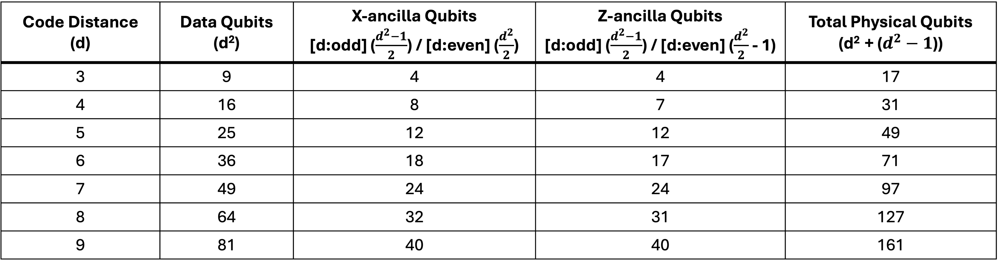
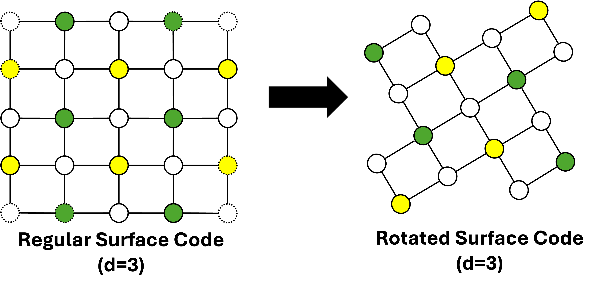
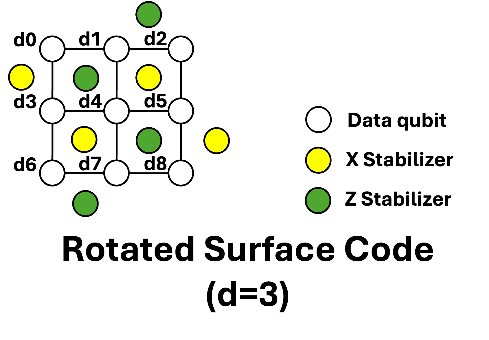

# Rotated Surface Code

# Objective
- Understand the **Rotated Surface Code [1, 2]**, which requires **fewer physical qubits** compared to the standard surface code
- Use **Stim (developed by Google) [3]**, to efficiently simulate and analyze Quantum Stabilizer Circuits, especially Quantum Error Correction (QEC).
- Perform **Monte-Carlo Simulation**: Analyze the **threshold** by plotting the **Logical Error Rate (LER)** against the **Physical Error Rate (p)** for various **code distance (d)**.

# Rotated Surface Code Parameters

# Overview
1) Regular to Rotated Surface Code Transformation

2) Rotated Surface Code Layout

# Configuration
- **QEC Code**: Rotated Surface Code (Memory Z)
- **Decoder**: PyMatching (MWPM) **[4]**
- **Shots**: $10^6$
- **Code Distance (d)**: 3, 5, 7, 9
- **Physical Error Rate (p)**: $10^{-4}$ to $10^{-2}$ (Depolarizing Noise)

# To do
- Implement the code.

# Getting Started
- $ python main.py

# Answer (surface_code_threshold.png)

# References
- **[1]** Bombín, Héctor, and Miguel A. Martin-Delgado. "Optimal resources for topological two-dimensional stabilizer codes: Comparative study." Physical Review A—Atomic, Molecular, and Optical Physics 76.1 (2007): 012305.
- **[2]** Horsman, Dominic, et al. "Surface code quantum computing by lattice surgery." New Journal of Physics 14.12 (2012): 123011.
- **[3]** Gidney, Craig. "Stim: a fast stabilizer circuit simulator." Quantum 5 (2021): 497.
- **[4]** Sparse {B}lossom: correcting a million errors per core second with minimum-weight matching.