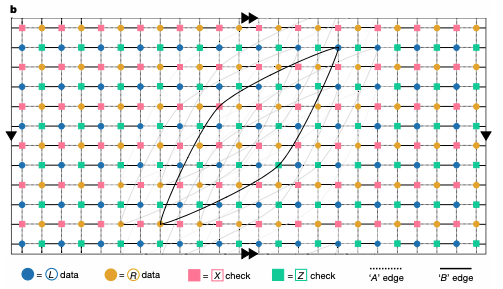

# QLDPC Code ([[144, 12, 12]] BB Code)

# Objective
- Understand the **Quantum Low-Density Parity Check (QLDPC) Code**, which requires a **fewer physical qubits** than Surface Code.
- Perform **Monte-Carlo Simulation**: Analyze the **threshold** by plotting the **Logical Error Rate (LER)** against the **Physical Error Rate (p)**.
- Compare the LER and the num of physical qubits against surface code.

# Overview

# Configuration
- **QEC Code**: [[144, 12, 12]] Bivariate Bicycle (BB) Code **[5]** (Gross Code)
- **Decoder**: BP-OSD **[3]**
- **Error Correction Capability**: ??? 6 qubit error 100% correction??
- **Shots**: ????
- **# of data qubits**: ???
- **# of ancilla qubits**: ???

# Getting Started
- $ python main.py

# Answer (gross_code_ler_stim.png)

# Additioanl Information (History)
- Derived from classical Low-Density Parity Check (LDPC) Code **[1]**.
- At first, QLDPC Code (e.g., Toric Code **[4]**) utilized Belief Propagation as a decoding method **[2]**.
- Issue: BP has a degeneracy to a Quantum due to a low cycle issue.
- Solution: **OSD (Ordered Statistics Decoding) [7]** method is combined.
- Result: **BP-OSD (Ordered Statistics Decoding) [3]** decoding.

# References
- **[1]** Gallager, R. G., "Low-density parity-check codes," IRE Transactions on Information Theory, Vol. 8, No. 1, pp. 21–28, 1962.
- **[2]** Poulin, D. and Chung, Y., "On the iterative decoding of sparse quantum codes," Quantum Information & Computation, Vol. 8, No. 10, pp. 987–1000, 2008.
- **[3]** Panteleev, Pavel, and Gleb Kalachev. "Degenerate quantum LDPC codes with good finite length performance." Quantum 5 (2021): 585.
- **[4]** Kitaev, A. Yu. "Fault-tolerant quantum computation by anyons." Annals of physics 303.1 (2003): 2-30.
- **[5]** Bravyi, Sergey, et al. "High-threshold and low-overhead fault-tolerant quantum memory." Nature 627.8005 (2024): 778-782.
- **[6]** J. Pearl, "Reverend Bayes on inference engines: A distributed hierarchical approach," in Proceedings of the Second National Conference on Artificial Intelligence (AAAI-82), Pittsburgh, PA, 1982, pp. 133–136.
- **[7]** Fossorier, Marc PC, and Shu Lin. "Soft-decision decoding of linear block codes based on ordered statistics." IEEE Transactions on information Theory 41.5 (1995): 1379-1396.