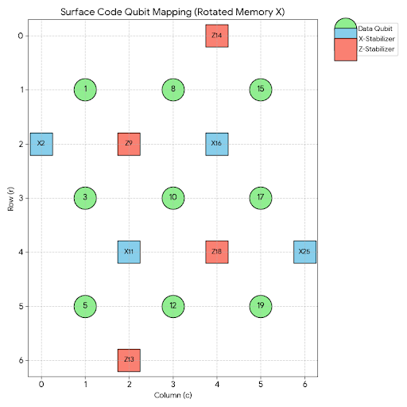

# Stim - Inspection Surface Code Structure

This project generates and inspects the structure of an ideal (noise-free) rotated surface code circuit using Google's Stim library.

# Contents [ideal_surface_code.stim]

The generated `.stim` file contains the full definition of a quantum error correction circuit. Its key components include:

- **QUBIT_COORDS**: Defines the 2D layout coordinates for each physical qubit, used for visualization.
- **R / RX (Reset)**: Initializes qubits into a specific state ($|0\rangle$ or $|+\rangle$).
    - **Initial Logical State: 0 (RX 1 3 5 8 10 12 15 17 19)**
- **TICK**: Represents a time step barrier. Operations between two TICKs are executed in parallel.
- **H / CX (Gates)**: Clifford gates (Hadamard and CNOT) used for syndrome extraction cycles.
- **M (Measure)**: Physical measurement of qubits at the end of a round or for syndrome extraction.
- **DETECTOR**: Defines XOR parity constraints for measurements. If a constraint is violated, it triggers a **Detection Event** that decoders use to track down physical errors.
- **OBSERVABLE_INCLUDE**: Defines the logical observable (Logical X) for the memory experiment (**Logical Error or not**).

# Output Files
- **circuit_timeline.png**: A visual gate-level representation showing the chronological **sequence** of quantum operations and measurements.
- **qubit_layout.png**: A 2D spatial map visualizing the grid arrangement and coordinate-based positions of all qubits.

## Qubit Mapping & Identification [ideal_surface_code.stim]

In the `rotated_memory_x` layout, qubits are placed on a 2D grid defined by `QUBIT_COORDS(r, c)`. You can distinguish their roles using the following rules:

### 1. Data Qubits (Data)
- **Coordinates**: Both row(`r`) and column(`c`) are **odd** numbers (e.g., `(1,1)`, `(3,1)`, `(5,1)`).
- **Role**: Store the physical qubit information.
- **In .stim file**: Initialized using `RX` (for X-basis memory) and are the targets of multiple CNOT gates.
- **Index**: 1, 3, 5, 8, 10, 12, 15, 17, 19

### 2. Ancilla Qubits (Measurement)
These are located between data qubits and are used to detect errors (Measurement errors can happen).
- **Coordinates**: Located at **even** coordinates (e.g., `(2,2)`, `(2,0)`).
- **How to distinguish X vs Z**:
    - **X-Stabilizers**: Identified by the `H` (Hadamard) gate applied to them before and after the interaction with data qubits. In this file, they follow the rule: `(r + c) / 2` is **Odd** (e.g., `(2,0)`, `(4,2)`, `(2,4)`).
        - **Index**: 2, 11, 16, 25
    - **Z-Stabilizers**: These interact with data qubits via CNOTs without Hadamard gates. They follow the rule: `(r + c) / 2` is **Even** (e.g., `(2,2)`, `(6,2)`, `(0,4)`).
        - **Index**: 9, 13, 14, 18

### 3. Interaction Sequence (4 CNOTs) in Syndrome Extraction - Based on data qubit location
The directions in the 2nd and 3rd CX steps are reversed
 - **Why?** To ensure mathematical commutativity between X and Z measurements and to suppress **Hook errors**, preventing single-qubit flips from propagating into fatal logical error chains.

| Step | Z-Stabilizer Position | X-Stabilizer Position |
| :---: | :--- | :--- |
| **1st CX** | **Top-Left** (TL) | **Top-Left** (TL)   *(e.g., `CX 2 3`, `CX 16 17`, `CX 11 12`)* |
| **2nd CX** | **Top-Right** (TR) | **Bottom-Left** (BL) |
| **3rd CX** | **Bottom-Left** (BL) | **Top-Right** (TR) |
| **4th CX** | **Bottom-Right** (BR) | **Bottom-Right** (BR) |

### 4. Detector
| Stage | Stim Logic (XOR Sum) | Purpose |
| :--- | :--- | :--- |
| **1. Initial** | $rec[-n] = 0$ | **Initialization Check**: Verifies X-stabilizers return 0 after |+> setup. |
| **2. Repeat** | $rec[-n] \oplus rec[-m] = 0$ | **Stability Check**: Compares the current syndrome to the previous round. |
| **3. Final** | $Data \oplus Ancilla = 0$ | **Readout Check**: Matches final data parity against the last syndrome. |
| **4. Logical** | `OBSERVABLE_INCLUDE` | **Success Criterion**: Final parity of the **Logical X** operator. |

#### Measurement Record Mapping (Final Round)

| Index | Target Qubit | Type | Description |
| :---: | :---: | :---: | :--- |
| `rec[-1]` | **Data 19** | Data | Final MX (Last measured) |
| `rec[-2]` | **Data 17** | Data | |
| `rec[-3]` | **Data 15** | Data | |
| `rec[-4]` | **Data 12** | Data | |
| `rec[-5]` | **Data 10** | Data | |
| `rec[-6]` | **Data 8** | Data | |
| `rec[-7]` | **Data 5** | Data | |
| `rec[-8]` | **Data 3** | Data | |
| `rec[-9]` | **Data 1** | Data | Final MX (First measured) |
| `rec[-10]` | **X 25** | Stabilizer | Round $T$ (Last Cycle) |
| `rec[-11]` | **Z 18** | Stabilizer | |
| `rec[-12]` | **X 16** | Stabilizer | |
| `rec[-13]` | **Z 14** | Stabilizer | |
| `rec[-14]` | **Z 13** | Stabilizer | |
| `rec[-15]` | **X 11** | Stabilizer | |
| `rec[-16]` | **Z 9** | Stabilizer | |
| `rec[-17]` | **X 2** | Stabilizer | Round $T$ (First measured) |
| `rec[-18]` | **X 25** | Stabilizer | Round $T-1$ (Previous Cycle) |
| `rec[-19]` | **Z 18** | Stabilizer | |
| `rec[-20]` | **X 16** | Stabilizer | |
| `rec[-21]` | **Z 14** | Stabilizer | |
| `rec[-22]` | **Z 13** | Stabilizer | |
| `rec[-23]` | **X 11** | Stabilizer | |
| `rec[-24]` | **Z 9** | Stabilizer | |
| `rec[-25]` | **X 2** | Stabilizer | |

#### Final Boundary Detectors

**1. Top-Left (X2): Data 3 ⊕ Data 1 ⊕ Last X2**
DETECTOR(2, 0, 1) rec[-8] rec[-9] rec[-17]

**2. Center (X16): Data 17 ⊕ 15 ⊕ 10 ⊕ 8 ⊕ Last X16**
DETECTOR(2, 4, 1) rec[-2] rec[-3] rec[-5] rec[-6] rec[-12]

**3. Center (X11): Data 12 ⊕ 10 ⊕ 5 ⊕ 3 ⊕ Last X11**
DETECTOR(4, 2, 1) rec[-4] rec[-5] rec[-7] rec[-8] rec[-15]

**4. Bottom-Right (X25): Data 19 ⊕ 17 ⊕ Last X25**
DETECTOR(4, 6, 1) rec[-1] rec[-2] rec[-10]

**Logical Observable (L_X): Data 15 ⊕ 8 ⊕ 1 (X along Top Boundary)**
OBSERVABLE_INCLUDE(0) rec[-3] rec[-6] rec[-9]
 - **Logical Flip**: Logical Observable $(L_X) \neq 0$ (Initial Logical State)
 - **Logical Failure**: Decoder (e.g., PyMatching) incorrectly predicts the logical flip

# Getting Started
- $ python Stim_Structure.py
- $ python Stim_Visualize.py