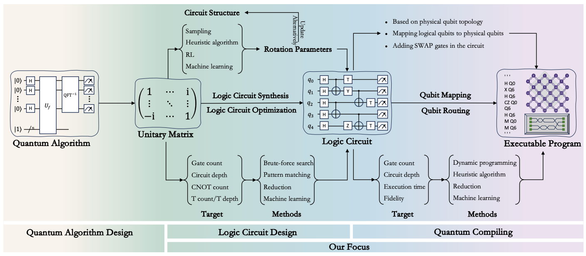

# Quantum Compilation

# Objective

- Understand the Compilation (Circuit, Mapping, Scheduling)

# Overview [1]

# References

- **[1]** Yan, Ge, et al. "Quantum circuit synthesis and compilation optimization: Overview and prospects." *arXiv preprint arXiv:2407.00736* (2024).
